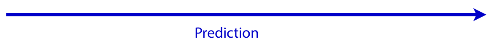
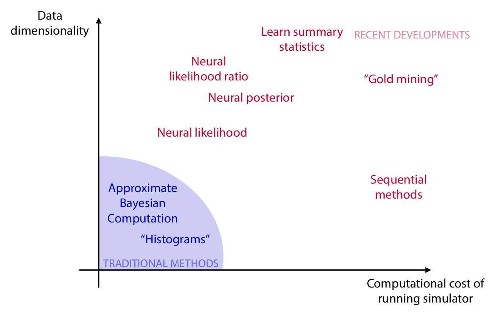

class: middle, center, title-slide
count: false

# Simulation-based inference:  Proceed with caution!

Likelihood-free in Paris 
April 21, 2022

 

Gilles Louppe 
[g.louppe@uliege.be](mailto:g.louppe@uliege.be)

---

class: middle, center

.grid[
.kol-1-5.center[.width-100[] Kyle Cranmer]
.kol-1-5.center[.width-100[] Johann Brehmer]
.kol-1-5.center[.width-100.circle[] Michael Kagan]
.kol-1-5.center[.width-100[] Joeri Hermans]
.kol-1-5.center[.width-90[] Antoine Wehenkel]
]

.grid[
.kol-1-5.center[.width-100.circle[] Norman Marlier]
.kol-1-5.center[.width-100.circle[] Arnaud Delaunoy]
.kol-1-5.center[.width-100.circle[] Maxime Vandegar]
.kol-1-5.center[.width-100.circle[] Malavika Vasist]
.kol-1-5.center[.width-90.circle[] Francois Rozet]
]

---

class: middle

.center.width-100[]

---

class: middle

.center.width-80[]

.center.width-70[]

.center[$$\theta, z, x \sim p(\theta, z, x)$$]

---

class: middle, center

.center.width-80[]

.center.width-70[]

.red.bold[Warning:] The likelihood
$p(x | \theta) = \int p(x, z| \theta) dz$
is intractable.

---

class: middle
count: false

# Simulation-based inference 

---

class: middle

Start with
- a simulator that can generate $N$ samples $x\_i \sim p(x\_i|\theta\_i)$,
- a prior model $p(\theta)$,
- observed data $x\_\text{obs} \sim p(x\_\text{obs} | \theta\_\text{true})$.

Then, estimate the posterior $$p(\theta|x\_\text{obs}) = \frac{p(x\_\text{obs} | \theta)p(\theta)}{p(x\_\text{obs})}$$

.center.width-35[]

---

class: middle

.avatars[]

.center.width-100[]

.footnote[Credits: [Cranmer, Brehmer and Louppe](https://doi.org/10.1073/pnas.1912789117), 2020.]

---

class: middle
count: false

.avatars[]

.center.width-100[]

.footnote[Credits: [Cranmer, Brehmer and Louppe](https://doi.org/10.1073/pnas.1912789117), 2020.]

---

class: middle
count: false

.avatars[]

.center.width-100[]

.footnote[Credits: [Cranmer, Brehmer and Louppe](https://doi.org/10.1073/pnas.1912789117), 2020.]

---

class: middle

.avatars[]

.width-100[]

.footnote[Credits: [Cranmer, Brehmer and Louppe](https://doi.org/10.1073/pnas.1912789117), 2020.]

---

class: middle

.avatars[]

## Neural ratio estimation (NRE)

The likelihood-to-evidence $r(x|\theta) = \frac{p(x|\theta)}{p(x)} = \frac{p(x, \theta)}{p(x)p(\theta)}$ ratio can be learned, even if neither the likelihood nor the evidence can be evaluated:

.grid[
.kol-1-4.center[

 

$x,\theta \sim p(x,\theta)$

    

$x,\theta \sim p(x)p(\theta)$

]
.kol-5-8[ .center.width-70[]]
.kol-1-8[    

$\hat{r}(x|\theta)$]
]

???

Interesting observations:
- MI(x,theta) = E_p(x,theta) log r(x,theta)
- The likelihood ratio is a sufficient statistic. 

---

class: middle

$$p(\theta|x) = \frac{p(x|\theta) p(\theta)}{p(x)} \approx \hat{r}(x|\theta) p(\theta)$$

 

.center.width-100[]

---

class: middle 

# ... but proceed with caution!

aka model checking, evaluation, and criticism.

---

class: middle
count: false

.grid[
.kol-1-2[ 
.center[]]
.kol-1-2[]
]

---

class: middle
count: false

.grid[
.kol-1-2[ 
.center[]]
.kol-1-2[
  
.center[<video controls autoplay loop muted preload="auto" height="300" width="400">
  <source src="./figures/galton.mp4" type="video/mp4">
</video>]

]
]

---

class: middle
count: false

.grid[
.kol-1-2[.center[]]
.kol-1-2[Prior model $p(\theta)$
    
Observational model $p(x|\theta)$]
]

???

This results in the Bayesian joint distribution $p(x, \theta)$.

---

class: middle, black-slide

.center.circle.width-50[]

.center["All models are wrong, but some are useful" - George Box]

---

class: middle

## The observational model $p(x | \theta)$

$p(x | \theta)$ should capture the pertinent structure of the true data generating process for the inference results to be useful.

A model that does not capture every precise detail of the true data generating process can still be useful if it captures the details relevant to the particular analysis goals. 

.footnote[Credits: [Michael Betancourt](https://betanalpha.github.io/assets/case_studies/principled_bayesian_workflow.html#14_Model_Adequacy), 2020.]

???

Put as much physics in the model as you can!

The richness of the model can be probed with prior and posterior predictive checks.

---

class: middle

The observational model can often be made richer by including in it additional .bold[nuisance parameters] $\nu$ that capture known unknowns. 

In this case, the likelihood becomes $$p(x | \theta) = \int p(x | \theta, \nu) p(\nu|\theta) d\nu.$$

Although nuisance parameters can reduce model misspecification, their presence and marginalization will result in increased uncertainties for the parameters $\theta$ of interest.

---

class: middle

.avatars[]

.center[

.width-70[]

<video controls preload="auto" height="225" width="500" autoplay loop>
  <source src="https://video.twimg.com/ext_tw_video/1445251463261872128/pu/vid/478x270/pVbx4507NgMLv3tn.mp4" type="video/mp4">
</video>

]

Nuisance parameters are used to model known unknowns in a robotic setup (e.g., camera position, table position, etc).

.footnote[Credits: [Marlier et al](https://arxiv.org/abs/2109.14275), 2021.]

---

class: middle

## The prior model $p(\theta)$

The prior model $p(\theta)$ specifies one's beliefs about the model parameters. It should reflect domain expertise.

---

class: middle

The consequences of the prior model in the context of the observational model can be diagnosed with .bold[prior predictive checks] to evaluate what data sets would be consistent with the prior. 

A prior predictive check generates data $x^\text{sim}$ according to the prior predictive distribution $p(x)$ as 
$$\begin{aligned}
\theta^\text{sim} \sim p(\theta)\\\\
x^\text{sim} \sim p(x | \theta^\text{sim}),
\end{aligned}$$
or summary statistics $T(x^\text{sim})$ thereof.

---

class: middle

.width-100[]

.footnote[Credits: [Gabry et al](https://arxiv.org/abs/1709.01449), 2017.]

---

class: middle

.avatars[]

In the absence of a good prior, .bold[neural empirical Bayes] can be used to estimate a prior distribution $p\_\phi(\theta)$ by maximizing the (log) evidence of a set of observations
$$\log p\_\phi(\\{x\_i\\}\_{i=1}^N) = \sum\_{i=1}^N \log \int p(x\_i | \theta) p\_\phi(\theta) d\theta.$$

.footnote[Credits: [Vandegar et al](https://arxiv.org/abs/2011.05836), 2021.]

---

class: middle

.avatars[]

.center.width-60[]

.footnote[Credits: [Vandegar et al](https://arxiv.org/abs/2011.05836), 2021.]

---

class: middle

.grid[
.kol-1-2[

## Computational faithfulness

$$\hat{p}(\theta|x) = \text{sbi}(p(x | \theta), p(\theta), x)$$

We must make sure our approximate simulation-based inference algorithms can (at least) actually realize faithful inferences on the observations we expect a priori -- i.e. those $x^\text{sim} \sim p(x)$.

]
.kol-1-2[.center.width-100[]]
]

---

class: middle

.avatars[]

.italic[Mode convergence:]

The maximum a posteriori estimate converges towards the nominal value $\theta^\*$ for an increasing number of independent and identically distributed observables $x\_i \sim p(x|\theta^\*)$:
$$\begin{aligned}
&\lim\_{N \to \infty} \arg\max\_\theta p(\theta | \\{ x\_i \\}\_{i=1}^N) \\\\
=& \lim\_{N \to \infty} \arg\max\_\theta p(\theta) \prod\_{x\_i} r(x\_i | \theta) = \theta^\*
\end{aligned}$$

.center.width-100[]

.footnote[Credits: [Brhemer et al](https://iopscience.iop.org/article/10.3847/1538-4357/ab4c41/meta), 2019.]

---

class: middle

.avatars[]

A common observation at the root of several other diagnostics is to check for the .bold[self-consistency] of the Bayesian joint distribution,
$$p(\theta) = \int p(\theta') p(x|\theta') p(\theta|x) d\theta'\, dx.$$

.grid[
.kol-2-3[
.italic[Coverage diagnostic:]
- For $x,\theta \sim p(x,\theta)$, compute the $1-\alpha$ credible interval based on $\hat{p}(\theta|x)$.
- If the fraction of samples for which $\theta$ is contained within the interval is larger than the nominal coverage probability $1-\alpha$, then the approximate posterior $\hat{p}(\theta|x)$ has coverage.]
.kol-1-3[.center.width-100[]]
]

.footnote[Credits: [Hermans et al](https://arxiv.org/abs/2110.06581), 2021; [Siddharth Mishra-Sharma](https://arxiv.org/abs/2110.01620), 2021.]

---

class: middle

.avatars[]

 

.center.width-90[]

.footnote[Credits: [Hermans et al](https://arxiv.org/abs/2110.06581), 2021.]

---

class: middle

Faithfulness diagnostics require the ability to repeatedly compute $\hat{p}(\theta|x)$, which is immediate for amortized approaches but .bold[computationally very heavy for sequential inference algorithms].

---

class: middle

What if the diagnostic fails?

???

- Use more data
- Use better NN architectures
- Use an ensemble

---

class: middle

.avatars[]

Neural ratio estimation can be forced to be more .bold[conservative], hence increasing the reliability of the approximate posteriors and reducing the risk of false inferences.

.center.width-100[]

---

class: middle

## Posterior predictive checks

If a model is a good fit, then we should be able to use it to generate data that resemble the data we observe.

Formally, this can be diagnosed with posterior predictive checks that generates data $x^\text{sim}$ according to the posterior predictive distribution $$p(x^\text{sim}|x) = \int p(x^\text{sim}|\theta) p(\theta|x) d\theta,$$
or summary statistics $T(x^\text{sim})$ thereof. 

---

class: middle

.width-100[]

.footnote[Credits: [Gabry et al](https://arxiv.org/abs/1709.01449), 2017.]

---

class: middle

.avatars[]

## Box's loop: build, compute, critique, repeat

.center.width-90[]

Science does not end at the inference results. Instead, they should inform the next revision of the model.

.footnote[Credits: [Blei](https://www.annualreviews.org/doi/full/10.1146/annurev-statistics-022513-115657), 2014.]

---

# Proceed with caution!

 

.question[Simulation-based inference is a major evolution in the statistical capabilities for science, enabled by advances in machine learning.]

.alert[Need to reliably and efficiently assess the adequacy of the full Bayesian model.]

.alert[Need to reliably and efficiently evaluate the quality of the posterior approximations.]

.alert[Need to efficiently generate simulated data and use it to train ML components.]
  
---

class: end-slide, center
count: false

The end.
