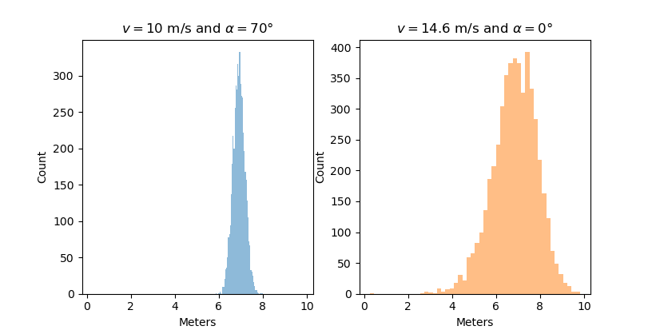
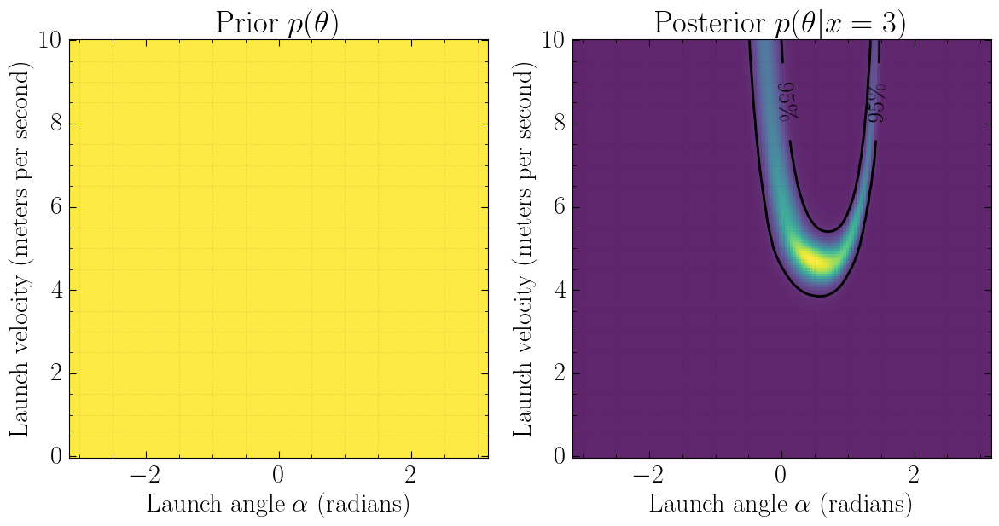
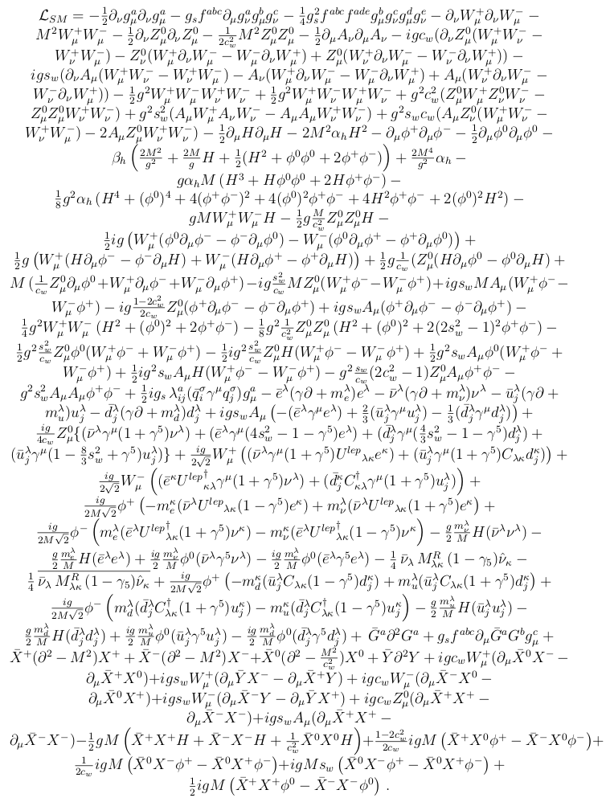
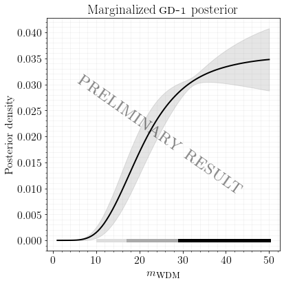

class: middle, center, title-slide
count: false

# Reliable Simulation-based Inference in the Physical Sciences

Particle physics colloquium, KIT<br>

January 12, 2023

<br>

Gilles Louppe<br>
[g.louppe@uliege.be](mailto:g.louppe@uliege.be)

---

class: middle, center

.grid[
.kol-1-5.center[.width-100[] Kyle Cranmer]
.kol-1-5.center[.width-100[] Johann Brehmer]
.kol-1-5.center[.width-100[] Joeri Hermans]
.kol-1-5.center[.width-100[] Antoine Wehenkel]
.kol-1-5.center[.width-90.circle[] Norman Marlier]
]

.grid[
.kol-1-5.center[.width-100.circle[] Siddharth Mishra-Sharma]
.kol-1-5.center[.width-100.circle[] Christoph Weniger]
.kol-1-5.center[.width-100.circle[] Arnaud Delaunoy]
.kol-1-5.center[.width-100.circle[] Malavika Vasist]
.kol-1-5.center[.width-90.circle[] Francois Rozet]
]

---

class: middle

.center.width-100[]

---

class: middle

.avatars[]

$$
v_x = v \cos(\alpha),~~ v_y = v \sin(\alpha),
$$

$$
\frac{dx}{dt} = v_x,~~\frac{dy}{dt} = v_y, \frac{dv_y}{dt} = -G.
$$

---

class: middle

.avatars[]

```python
def simulate(v, alpha, dt=0.001):
    v_x = v * np.cos(alpha)  # x velocity m/s
    v_y = v * np.sin(alpha)  # y velocity m/s
    y = 1.1 + 0.3 * random.normal()
    x = 0.0

    while y > 0: # simulate until ball hits floor
        v_y += dt * -G  # acceleration due to gravity
        x += dt * v_x
        y += dt * v_y

    return x + 0.25 * random.normal()
```

---

class: middle, center

.avatars[]

The computer simulator defines the likelihood function $p(x|\theta)$ implicitly.

.center.width-100[]

---

class: middle, center

What parameter values $\theta$ are the most plausible?

---

class: middle

$$p(\theta|x\_\text{obs}) = \frac{p(x\_\text{obs} | \theta)p(\theta)}{p(x\_\text{obs})}$$

---

class: middle

.avatars[]

.center.width-100[]

---

class: center, middle, black-slide

## The case of particle physics

.width-55[]

---

background-image: url(./figures/lhc.gif)
class: center, middle, black-slide

---

class: middle

.center.width-90[]
.grid[
.kol-1-5.center[
SM with parameters $\theta$

.width-100[]]
.kol-2-5.center[
Simulated observables $x$

.width-80[]]
.kol-2-5.center[
Real observations $x\_\text{obs}$

.width-80[]
.width-80[]]
]

---

class: middle

.width-100[]

???

generation: pencil and paper calculable from first principles

---

count: false
class: middle

.width-100[]

???

parton shower + hadronization: controlled approximation of first principles + phenomenological model

---

count: false
class: middle

.width-100[]

???

detector simulation: interaction with the materials and digitization

---

count: false
class: middle

.width-100[]

???

reconstruction simulation

---

class: middle

$$p(x|\theta) = \underbrace{\iiint}\_{\text{yikes!}} p(z\_p|\theta) p(z\_s|z\_p) p(z\_d|z\_s) p(x|z\_d) dz\_p dz\_s dz\_d$$

???

That's bad!

---

.avatars[]

# Neural ratio estimation (NRE)

The likelihood-to-evidence $r(x|\theta) = \frac{p(x|\theta)}{p(x)} = \frac{p(x, \theta)}{p(x)p(\theta)}$ ratio can be learned, even if neither the likelihood nor the evidence can be evaluated:
<br><br>
.grid[
.kol-1-4.center[

<br>

$x,\theta \sim p(x,\theta)$

<br><br><br><br>

$x,\theta \sim p(x)p(\theta)$

]
.kol-5-8[<br>.center.width-70[]]
.kol-1-8[<br><br><br><br>

$\hat{r}(x|\theta)$]
]

.footnote[Credits: [Cranmer et al](https://arxiv.org/pdf/1506.02169.pdf), 2015; [Hermans et al](http://proceedings.mlr.press/v119/hermans20a/hermans20a.pdf), 2020.]

---

class: middle

.avatars[]

The solution $d$ found after training  approximates the optimal classifier
$$d(x, \theta) \approx d^\*(x, \theta) = \frac{p(x, \theta)}{p(x, \theta)+p(x)p(\theta)}.$$
Therefore, $$r(x|\theta) = \frac{p(x|\theta)}{p(x)} = \frac{p(x, \theta)}{p(x)p(\theta)} \approx \frac{d(x, \theta)}{1-d(x, \theta)} = \hat{r}(x|\theta).$$

???

Derive on blackboard.

---

class: middle

.avatars[]

.center.width-100[]

---

class: middle

.avatars[]

## Hunting new physics at particle colliders (Frequentist)

.center.width-70[]

.footnote[Credits: [Brehmer et al](https://arxiv.org/pdf/1805.00020), 2018.]

???

We consider Higgs production in weak boson fusion (WBF) with a decay of the Higgs into four leptons,

---

class: middle

.avatars[]

.center.width-100[]

.footnote[Credits: [Brehmer et al](https://arxiv.org/pdf/1805.00020), 2018.]

???

Conclusions:

- With enough training data, the ML algorithms get the likelihood function right.

- Using more information from the simulator improves sample efficiency substantially.

(baseline: 2d histogram analysis of jet momenta and angular correlations)

---

background-image: url(./figures/stellar.jpeg)
background-position: left
class: black-slide

.avatars[]

.smaller-x[ ]
## Constraining dark matter with stellar streams (Bayesian)

<br><br><br><br><br><br>
.pull-right[
  
<iframe width="360" height="270" src="https://www.youtube.com/embed/uQVv_Sfxx5E?&loop=1&start=0" frameborder="0" volume="0" allowfullscreen></iframe>

]

.footnote[Image credits: C. Bickel/Science; [D. Erkal](https://t.co/U6KPgLBdpz?amp=1).].]

---

class: middle

.avatars[]

.center.width-90[]

.center[
.width-35[]
.width-35[]

]

.footnote[Credits: [Hermans et al](https://arxiv.org/pdf/2011.14923), 2021.]

---

class: black-slide, center, middle

.width-100[]

Preliminary results for GD-1 suggest a .bold[preference for CDM over WDM].

---

# Neural Posterior Estimation (NPE)

.pull-right[]

Use variational inference to directly estimate the posterior, by solving
$$
\begin{aligned}
&\min\_{q\_\phi} \mathbb{E}\_{p(x)}\left[ \text{KL}( p(\theta|x) || q\_\phi(\theta|x) ) \right]
\end{aligned}$$
where $q\_\phi$ is a neural density estimator, such as a normalizing flow.

???

Derive on blackboard

$$
\begin{aligned}
&\min\_{q\_\phi} \mathbb{E}\_{p(x)}\left[ \text{KL}( p(\theta|x) || q\_\phi(\theta|x) ) \right] \\\\
=& \min\_{q\_\phi} \mathbb{E}\_{p(x)} \mathbb{E}\_{p(\theta|x)} \left[\log \frac{p(\theta|x)}{q\_\phi(\theta|x)} \right] \\\\
=& \max\_{q\_\phi} \mathbb{E}\_{p(x, \theta)} \left[ \log q\_\phi(\theta|x) \right]
\end{aligned}$$

---

class: middle, black-slide

## Exoplanet atmosphere characterization (Bayesian)

.center.width-95[]

.footnote[Credits: [NSA/JPL-Caltech](https://www.nasa.gov/topics/universe/features/exoplanet20100203-b.html), 2010.]

---

class: middle

.avatars[]

.center[
.width-25[]
.width-70[]
]

---

# Computational faithfulness

<br>

.grid[
.kol-1-2[
<br>
$$\hat{p}(\theta|x) = \text{sbi}(p(x | \theta), p(\theta), x)$$

We must make sure our approximate simulation-based inference algorithms can (at least) actually realize faithful inferences on the (expected) observations.

]
.kol-1-2[.center.width-80[]

.center.italic[How do we know this is good enough?]]
]

---

class: middle

.avatars[]

.italic[Mode convergence:]

The maximum a posteriori estimate converges towards the nominal value $\theta^\*$ for an increasing number of independent and identically distributed observables $x\_i \sim p(x|\theta^\*)$:
$$\begin{aligned}
&\lim\_{N \to \infty} \arg\max\_\theta p(\theta | \\{ x\_i \\}\_{i=1}^N) \\\\
=& \lim\_{N \to \infty} \arg\max\_\theta p(\theta) \prod\_{x\_i} r(x\_i | \theta) = \theta^\*
\end{aligned}$$

.center.width-100[]

.footnote[Credits: [Brehmer et al](https://iopscience.iop.org/article/10.3847/1538-4357/ab4c41/meta), 2019.]

---

class: middle

.avatars[]

A common observation at the root of several other diagnostics is to check for the .bold[self-consistency] of the Bayesian joint distribution,
$$p(\theta) = \int p(\theta') p(x|\theta') p(\theta|x) d\theta'\, dx.$$

.grid[
.kol-2-3[
.italic[Coverage diagnostic:]
- For $x,\theta \sim p(x,\theta)$, compute the $1-\alpha$ credible interval based on $\hat{p}(\theta|x)$.
- If the fraction of samples for which $\theta$ is contained within the interval is larger than the nominal coverage probability $1-\alpha$, then the approximate posterior $\hat{p}(\theta|x)$ has coverage.]
.kol-1-3[.center.width-100[]]
]

.footnote[Credits: [Hermans et al](https://arxiv.org/abs/2110.06581), 2021; [Siddharth Mishra-Sharma](https://arxiv.org/abs/2110.01620), 2021.]

---

class: middle

.avatars[]

.center.width-70[]

---

class: middle

.avatars[]

<br>

.center.width-90[]

.footnote[Credits: [Hermans et al](https://arxiv.org/abs/2110.06581), 2021.]

---

class: middle, center

What if diagnostics fail?

???

- Use more data
- Use better NN architectures
- Use an ensemble

---

# Balanced NRE

.avatars[]

Enforce neural ratio estimation to be .bold[conservative] by using binary classifiers $\hat{d}$ that are balanced, i.e. such that
$$
\mathbb{E}\_{p(\theta,x)}\left[\hat{d}(\theta,x)\right] = \mathbb{E}\_{p(\theta)p(x)}\left[1 - \hat{d}(\theta,x)\right].
$$

<br>

.center.width-100[]

.footnote[Credits: [Delaunoy et al](https://arxiv.org/abs/2208.13624), 2022.]

---

# Summary

<br><br><br>

.question[Simulation-based inference is a major evolution in the statistical capabilities for science, enabled by advances in machine learning.]

.alert[Need to reliably and efficiently evaluate the quality of the posterior approximations.]

---

class: end-slide, center
count: false

The end.